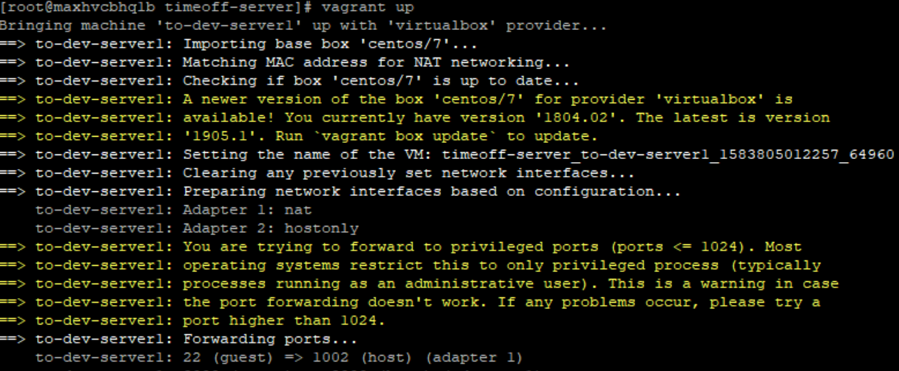
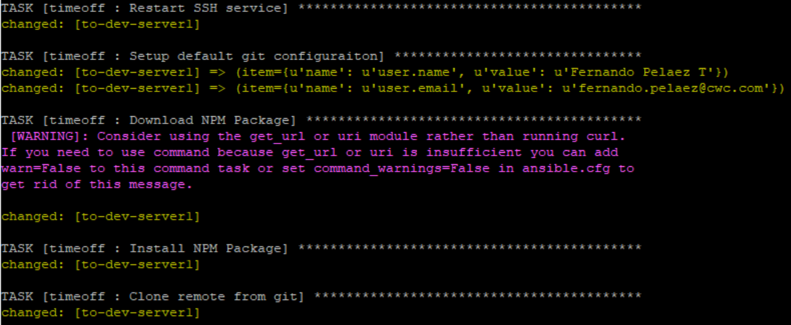
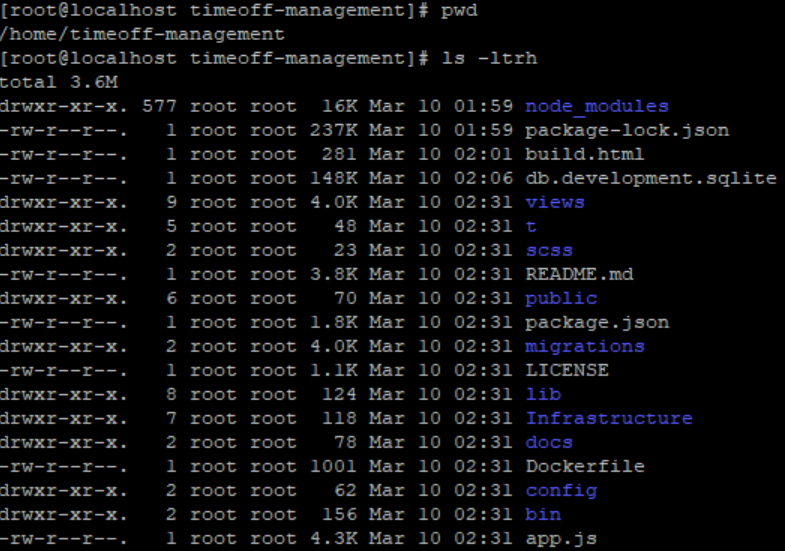
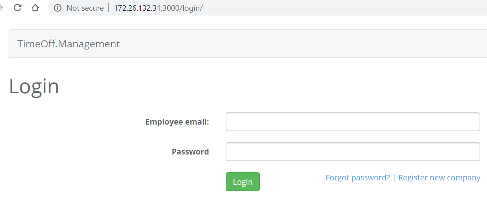
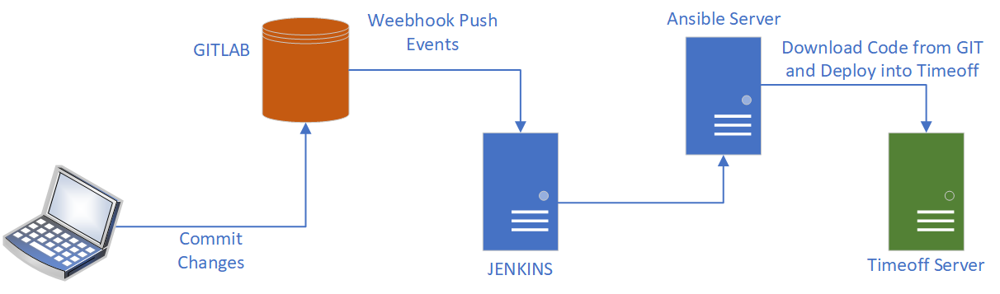
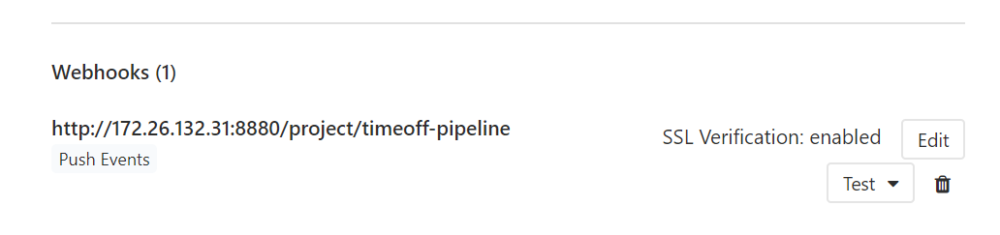
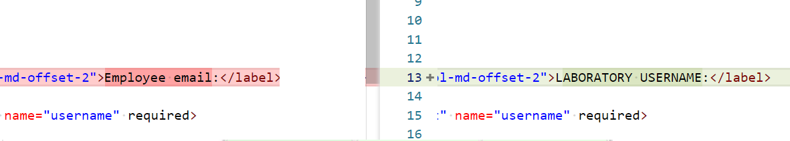
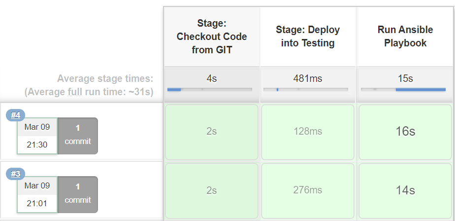
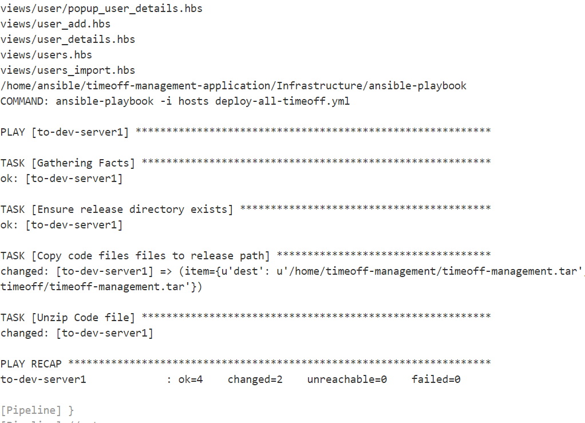
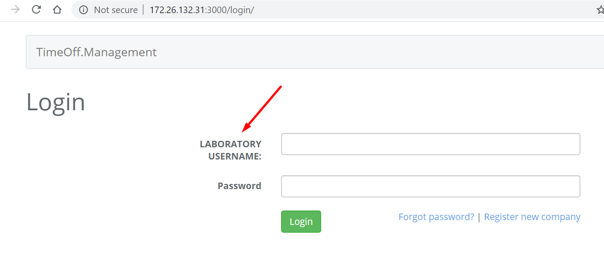

# Documentation

## Instructions to Deploy

### Pre-requisites

- Have a machine with Vagrant + VirtualBox
- Have a machine with Ansible
- Have a GIT server installed
- Have a Jenkis server installed

### Setting Up Timeoff Server

For setting up the environment Vagrant was used integrated with Ansible to create a Centos7 VM. The ansible configuration in this case provison the server using two roles common and timeoff. Common role is in charged of installing basic packages like epel-release and gcc-c++. Timeoff role make the first application configuration installing in the server the NPM package and downloading and deploying the default application. To make this possible the timeoff VM server was provisioned with the necessary SSH keys to clone the repository.

- This configuration can be found in Infrastructure\timeoff-server

The following is the list of the steps to provision the first version of the application

- Connect to Host Server
- Clone Repository
  - cd /home/vagrant/
  - git clone git@172.28.8.155:fernando.pelaez/timeoff-management-application.git
- Change to working directory
  - cd /home/vagrant/timeoff-management-application/Infrastructure/timeoff-server
  - git pull (check latest changes)
- Run 'vagrant up'

We now can connect to the VM and check tha the application code is there

If we install and start the application we will see something like this using our browser

- Connect to VM and start service
  - cd /home/timeoff-management
  - npm install
  - npm start or nohup npm start </dev/null >/dev/null 2>&1 &

### Configure Ansible

Now that we have our first version of the app, we need to enable our Configuration Management. In this case we will use Ansible again so we need to provision the server to allow SSH commands. The following steps allow the user 'ansible' to run commands in our Timeoff server without asking for a password.

- Connect to VM and configure Ansible
  - Configure password for Ansible
    - groupadd ansible
    - useradd ansible -g ansible
    - passwd ansible
  - Configure sudoers (/etc/sudoers)
    - ansible ALL=(ALL)       NOPASSWD: ALL
  - mkdir -p /home/ansible/.ssh
  - chmod 700 /home/ansible/.ssh
  - chown -R ansible:ansible /home/ansible/.ssh
- Connect to Ansible Server
  - Delete previous entries for same hostname in /root/.ssh/known_hosts
  - cd /home/ansible/timeoff-management-application/Infrastructure/ansible-playbook
  - ssh-copy-id -f -i /root/.ssh/id_rsa.pub ansible@to-dev-server1
  - ssh ansible@to-dev-server1 'chmod 640 .ssh/authorized_keys'

## Architecture

Now it's time to test our CICD and making changes to see how are deployed.

The following image show the CICD architecture used for this lab

For our CICD we have a Gitlab server where our code is stored. Once the repository identify any commit, it will trigger a webhook which invokes a Jenkins Pipeline.

Let's test one change making inserting the word "LABORATORY USERNAME" instead of "Employee email" in the login page (file views\login.hbs)

In Jenkins we used a jenkins file with a basic steps which clone the repository and then invokes an ansible playbook in the Ansible Server. The jenkinsfile used can be found in Infrastructure\jenkins\timeoff.jenkinsfile

The ansible playbook used is located in Infrastructure\ansible-playbook. First run a bash script called deploy-all-timeoff.sh that clone the repository and created a local tar file. Then using the playbook deploy-all-timeoff.yml the tar is send to the Timeoff server and unzip there with all files,, including our last change.

If we check our app, we will see that the changed was applied succesfully

## TO-DO

There are things to improve in this pipeline configuration that because of time constraint were not completed

- Use an artifact manager instead of deploying the code using tar files
- Automate Ansible configuration to avoid manual steps
- Create a service to allow the application work as a daemon
- Include basics tests to know if the application was deployed successfully

Any questions please contact me at fpelaezt@gmail.com
